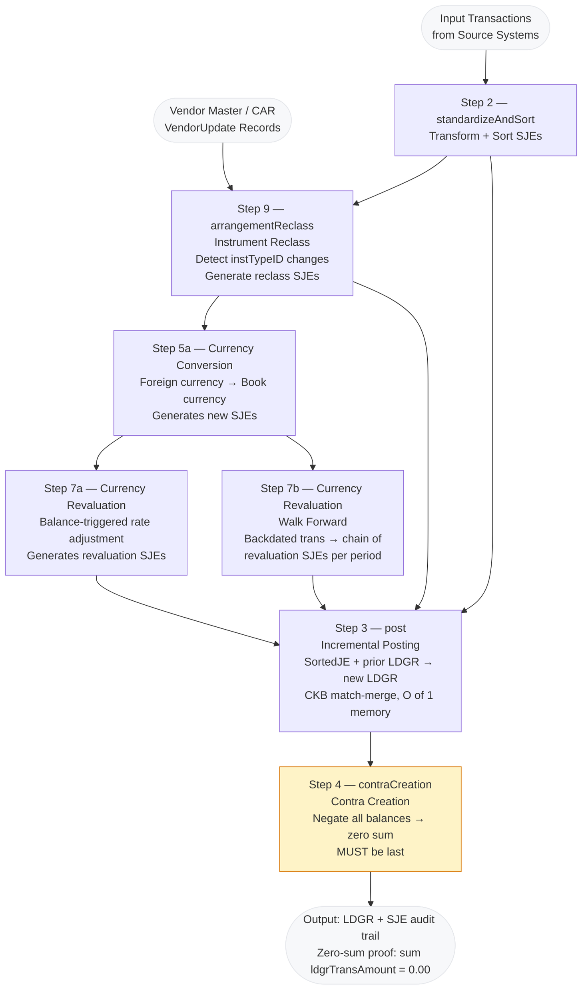

# GenevaERS Ledger POC Functional Specifications — Using VA Data

**Author:** Kip Twitchell  
**Original date:** April 14, 2018 · Updated May 26, 2021  
**Converted to Markdown:** Session 25 (docx removed; all data-sample images replaced with narrative
descriptions; Order of Processing diagram converted to Mermaid)

> **Vocabulary note:** This document was written against the original GenevaERS Ledger vocabulary.
> Where terms differ from the current pipeline vocabulary, the current term is shown in brackets.
> Key mappings: *Arrangement* → **Instrument**, *Arrangement ID* → **Instrument ID**,
> *Base JSF (Journal Summary File)* → **Instrument Ledger (LDGR)**, *SAL* → **CAR (Contract
> Attributes Record)*.

---

## Table of Contents

1. [GenevaERS Ledger Stated PoC Requirements](#1-genevaers-ledger-stated-poc-requirements)
2. [Document Scope and Data Structures](#2-document-scope-and-data-structures)
3. [Transaction Write — SJE Writing](#3-transaction-write--sje-writing)
4. [Posting Process — Incremental Posting](#4-posting-process--incremental-posting)
5. [Currency Conversion](#5-currency-conversion)
6. [Contra Creation](#6-contra-creation)
7. [Currency Revaluation](#7-currency-revaluation)
8. [Currency Revaluation Walk Forward](#8-currency-revaluation-walk-forward)
9. [Instrument Reclass](#9-instrument-reclass)
10. [Order of Processing](#10-order-of-processing)
11. [Subsequent Reporting](#11-subsequent-reporting)

---

## 1. GenevaERS Ledger Stated PoC Requirements

The GenevaERS Ledger lists the following functions to be performed in one pass through the
database:

- Instrument Reclass [originally: Arrangement Reclass]
- Currency Conversion
- Currency Revaluation
- Currency Revaluation Walk Forward
- Contra Creation (included in the SJE Writing sub-flow below)
- SJE Writing (Write SJEs to Disk)
- Incremental Posting (Create incremental Base JSF [Instrument Ledger])

This document outlines how to use the VA data to demonstrate these functions, starting from
the easiest requirement to the most difficult.

---

## 2. Document Scope and Data Structures

This document ignores the initial record transformation, master data change-data-capture
requirements, and ID assignment processes performed in the VA Demo System. It is focused on the
Posting Process which updates master files, balances, and creates some new transactions.

The following are the relevant data structures:

**(1) Vendor Master [CAR]** — contains vendor name and associated attributes. Sample fields:

| Field | Example value | Description |
|---|---|---|
| `instID` | 1229771 | Instrument ID (Vendor ID) — primary key |
| `instVendorName` | ACME SUPPLY INC | Vendor name |
| `instTypeID` | EXP | Instrument type: `EXP` (expense) or `REV` (revenue) |
| `instNominalAccount` | EXP202 | Nominal account prefix, derived from `instTypeID` |
| `instEffectDate` | 1/1/03 | Effective date of this Vendor Master record version |
| `instEffectEndDate` | 12/31/03 | End date of this version; `9999-99-99` = current |

Multiple rows per `instID` are possible once the CAR update cycle runs (date-effective
history). A join to Instrument ID 1229771 with an effective date of 5/5/03 for
`instTypeID` should return `EXP`.

**(2) Balances [LDGR — Instrument Ledger]** — multiple balances per Vendor. Sample fields:

| Field | Example value | Description |
|---|---|---|
| `ldgrIPID` | 1229771 | Instrument ID — foreign key to Vendor Master |
| `ldgrLedgerPeriod` | 200301 | Accounting period (YYYYMM) |
| `ldgrNominalAccount` | EXP202 | Balance account (must stay in sync with Vendor Master) |
| `ldgrTransAmount` | 559.47 | Accumulated balance amount for this period and account |
| `ldgrCurrency` | USD | Currency of balance |

There are typically multiple balance rows per vendor per period (one per nominal account).

**(3) Transactions [SortedJE — Standard Journal Entries]** — multiple transactions per balance.
Sample fields:

| Field | Example value | Description |
|---|---|---|
| `transIPID` | 1229771 | Instrument ID |
| `transLedgerPeriod` | 200301 | Accounting period |
| `transNominalAccount` | EXP202 | Account being posted to |
| `transAmount` | 559.47 | Transaction amount (debit positive, credit negative) |
| `transEffectDate` | 3/15/03 | Transaction effective date |
| `transCurrency` | USD | Transaction currency |

Any balance maintained in the system must be fully reconstructable by summing all transactions
created in history for that balance. A balance is considered wrong if there is not a supporting
transaction for it.

**(4) Vendor Update Records [VendorUpdate]** — required only for the Instrument Reclass process.
These records are new versions of Vendor Master records since the last execution. Sample fields:

| Field | Example value | Description |
|---|---|---|
| `instID` | 1229771 | Instrument ID being updated |
| `instTypeID_old` | EXP | Prior instrument type |
| `instTypeID_new` | REV | New instrument type |
| `instEffectDate` | 7/1/03 | Effective date of the change |
| `change_type` | RECLASS | `RECLASS` (triggers SJEs) or `ATTR_ONLY` (attribute-only, no SJEs) |

There are also small reference tables describing code tables used in the process (see
[Currency Conversion](#5-currency-conversion) for the Legal Entity and Exchange Rate tables).

---

## 3. Transaction Write — SJE Writing

**"Write SJEs to Disk"**

SJE = Standard Journal Entry. This requirement states that any new transactions created during
the process must be written out to file to provide a complete audit trail of all updates made to
any master file or balance record. The transactions provide proof of the balance.

**Example — input transaction (expense posting):**

```
transIPID=1229771  transLedgerPeriod=200301  transNominalAccount=EXP202
transAmount=559.47  transEffectDate=3/15/03  transCurrency=USD
```

When this input transaction triggers a reclass process (see
[Instrument Reclass](#9-instrument-reclass)), it will spawn the creation of a generated
transaction. For example, if the vendor is reclassed from EXP to REV:

**Generated SJE (credit to EXP202, debit to REV202):**

```
transIPID=1229771  transLedgerPeriod=200301  transNominalAccount=REV202
transAmount=559.47  transEffectDate=3/15/03  transCurrency=USD
transSourceType=RECLASS  transOriginatingID=<source_trans_id>
```

Both the originating input transaction and all generated transactions must be stored in the SJE
audit trail file. This is the basis of the zero-sum proof: if all transactions (input + generated)
are posted, the sum of all `ldgrTransAmount` across all accounts must equal 0.00.

---

## 4. Posting Process — Incremental Posting

**"Create incremental Base JSF [Instrument Ledger]"**

This requirement is to update any balance maintained in the system with its associated
transactions which have either been:

1. received as input from source systems since the last update cycle, or
2. generated during the execution of this process.

**Example — before posting:**

The input transaction (`transIPID=1229771`, `transNominalAccount=EXP202`,
`transAmount=559.47`) must update the EXP202 balance row.

**Balance before posting (EXP202 account):**

```
ldgrIPID=1229771  ldgrLedgerPeriod=200301  ldgrNominalAccount=EXP202
ldgrTransAmount=0.00  [new period, no prior balance]
```

**Balance after posting the input transaction:**

```
ldgrIPID=1229771  ldgrLedgerPeriod=200301  ldgrNominalAccount=EXP202
ldgrTransAmount=559.47
```

If a reclass also generates a REV202 transaction, that transaction simultaneously posts to the
REV202 balance row for the same period:

```
ldgrIPID=1229771  ldgrLedgerPeriod=200301  ldgrNominalAccount=REV202
ldgrTransAmount=559.47
```

Both updated balances must be written to output files for use in the next update cycle. This is
the CKB (Common Key Buffering) match-merge: the SortedJE file and the prior LDGR file are both
sorted on the same key; a single streaming two-pointer pass merges new transactions into the
prior balance to produce the new LDGR without loading either file into memory.

---

## 5. Currency Conversion

When a transaction is received in a foreign currency (different from the Book of Record currency
for the legal entity), a new transaction must be created which converts it to the book currency.
The currency of the book is designated on the legal entity (Agency in the VA data) reference file.

**Legal Entity (Agency) Table — sample:**

| `legalEntityID` | `agencyName` | `baseCurrency` |
|---|---|---|
| 0001 | DEPT OF TRANSPORTATION | USD |
| 0002 | DEPT OF EDUCATION | USD |
| 0047 | INTL TRADE OFFICE | EUR |

**Currency Exchange Rate Table — sample:**

| `rateDate` | `currencyFrom` | `currencyTo` | `exchangeRate` |
|---|---|---|---|
| 2003-01-01 | CAD | USD | 0.6316 |
| 2003-01-01 | EUR | USD | 1.0487 |
| 2003-03-15 | CAD | USD | 0.6891 |
| 2003-03-15 | EUR | USD | 1.0812 |

**Join logic:**

1. From the originating transaction, use the `legalEntityID` to look up `baseCurrency` in the
   Legal Entity Table.
2. Use `baseCurrency` (target), `transCurrency` (source), and `transEffectDate` to look up the
   applicable rate in the Rate Table.
   - *Effective date fallback:* if the exact date is not found (e.g. a public holiday), the
     system extracts the rate from the closest prior date. This is specified in the GenevaERS
     Ledger document as "Effective date look up."
3. Multiply the rate by `transAmount` to produce the converted transaction amount.

**Example — input transaction in CAD:**

```
transIPID=1229771  transLedgerPeriod=200301  transAmount=812.00  transCurrency=CAD
transEffectDate=3/15/03  legalEntityID=0001  [book currency = USD]
```

Rate lookup: CAD→USD on 3/15/03 = 0.6891. Generated USD transaction:

```
transIPID=1229771  transLedgerPeriod=200301  transAmount=559.47  transCurrency=USD
transEffectDate=3/15/03  transSourceType=CURRENCY_CONVERSION
```

> **Precision note:** Care is required in rounding and precision for these calculations.
> Differences in floating-point arithmetic can accumulate to millions of dollars across
> a large transaction volume.

---

## 6. Contra Creation

Contra Creation produces transactions that:

1. Are **summarized** — they do not include the Vendor (Instrument ID) or the Balance ID fields.
2. Are the **negation** of the total outstanding balance on all Vendor Balances: each balance
   amount is multiplied by −1, creating a negating transaction that, when posted, makes the
   entire ledger file sum to zero.

This process must run **after** all balances have been updated by all other transactions
(both input and generated), including Instrument Reclass and Currency Revaluation. Contra
is always the last step.

**Example — balances before contra (three vendors, single account each):**

| `ldgrIPID` | `ldgrNominalAccount` | `ldgrTransAmount` |
|---|---|---|
| 1229771 | EXP202 | 559.47 |
| 1304422 | EXP202 | 1,204.00 |
| 0000000 | EXP202 | 0.00 |

Total outstanding on EXP202 = 1,763.47.

**Contra transaction to be created (summarized, no Instrument ID):**

```
ldgrIPID=0000000  ldgrNominalAccount=EXP202  ldgrTransAmount=-1,763.47
transSourceType=CONTRA
```

Although shown in balance format above, these must be created as transactions, then posted to
any existing summarized balance rows. After posting, the sum of all `ldgrTransAmount` across all
rows for EXP202 = 0.00. This is the **zero-sum proof** validated by the C1 smoke test.

---

## 7. Currency Revaluation

Currency Revaluation reflects changes in the USD-equivalent value of balances held in foreign
currencies, caused by exchange rate movements since the balance was created. For example, a
balance of CAD 1,000 held over multiple years will have a different USD equivalent each year
as exchange rates fluctuate. Any USD-equivalent balance in the system must be adjusted with new
transactions to reflect these changes.

This process is **triggered from Balance records** (not from input transactions — that is
Currency Conversion). As the system scans balance records, it uses the Legal Entity Table to
detect where the target currency of the balance differs from the book currency.

**Identifying revaluation-eligible balances:**

```
ldgrIPID=1229771  ldgrNominalAccount=EXP202  ldgrCurrency=CAD  ldgrTransAmount=1,000.00
legalEntityID=0001  [book currency = USD → eligible for revaluation]
```

**Current vs. Prior Processing Date lookup:**

The system tests the current processing date against the Historical Processing Table to identify
which prior period should be revalued. Example:

| `processingDate` | `priorProcessingDate` |
|---|---|
| 2/1/03 | 1/1/03 |

Only balances for the **prior period** are revalued — not historical balances. So on 2/1/03,
the system revalues balances dated 1/1/03.

**Rate lookup for revaluation:**

Using the Rate Table with both the current and prior processing dates:

| `rateDate` | `currencyFrom` | `currencyTo` | `exchangeRate` |
|---|---|---|---|
| 2003-01-01 (prior) | CAD | USD | 1.10 |
| 2003-02-01 (current) | CAD | USD | 1.12 |

**Revaluation transaction calculation:**

```
revalAmount = balance × (currentRate − priorRate)
            = 1,000.00 × (1.12 − 1.10)
            = 1,000.00 × 0.02
            = 20.00    [adjustment for exchange rate movement]
```

(In the original document example, the balance was 559.47, yielding an adjustment of
559.47 × 0.02 = 11.19.)

**Generated revaluation SJE:**

```
transIPID=1229771  transLedgerPeriod=200301  transNominalAccount=EXP202
transAmount=11.19  transSourceType=CURRENCY_REVALUATION
```

This transaction is posted to the EXP202 balance, producing a new balance of
559.47 + 11.19 = 570.66.

> **Effective date fallback:** As with Currency Conversion, if the exact rate date is not found
> the system uses the closest prior date.

---

## 8. Currency Revaluation Walk Forward

This process follows the same logic as [Currency Revaluation](#7-currency-revaluation) but
instead of generating a single transaction, it generates **multiple transactions** because a
backdated input transaction has arrived from a prior period.

**Scenario:**

A transaction arrives in 2004 but is backdated to 2003. The backdated transaction must carry
forward all revaluation effects that would have applied to subsequent periods.

**Example — backdated input transaction (arrived in 2004, effective in 2003):**

```
transIPID=1229771  transLedgerPeriod=200301  transAmount=812.00  transCurrency=CAD
transEffectDate=3/15/03  [processed in 2004 update cycle]
```

After Currency Conversion (CAD→USD at the 3/15/03 rate), a USD equivalent SJE is generated
for period 200301.

The revaluation walk-forward then generates a **chain of revaluation SJEs** — one per period
from the original effective date through to the current period. For a transaction backdated from
2004 to 2003, this means generating one 2003 revaluation SJE and one 2004 revaluation SJE,
using the applicable exchange rates for each period transition.

**Walk-forward chain (example, one period boundary):**

```
Period 200301 revaluation SJE:  transAmount = balance × (rate_0401 − rate_0301)
Period 200401 revaluation SJE:  transAmount = balance × (rate_0402 − rate_0401)
```

Each generated SJE must be posted to the appropriate balance for its period.

> **Scale note:** GenevaERS Ledger maintains daily accounting periods. Some transactions are
> backdated more than six months, potentially generating hundreds of walk-forward SJEs. More
> commonly, backdating is a few days or weeks. All generated transactions must be posted to
> the appropriate period balances.

---

## 9. Instrument Reclass

[Original doc: "Arrangement Reclass"]

Instrument Reclass is the most complex process, particularly when it includes backdated
processing (like Currency Revaluation Walk Forward). It is described below.

**Trigger:** When a Vendor Master record changes and the changed data affects how attributes
are stored on balances, reclassification processes are required.

**The VA data reclass condition:** The prefix of the Nominal Account (`EXP` or `REV`) must
remain in sync with the `instTypeID` on the Vendor Master record. If a Vendor Master update
changes `instTypeID` from `EXP` to `REV`, then new transactions must be generated to move all
existing balances from `EXPnnn` accounts to `REVnnn` accounts.

**Example — prior Vendor Master record:**

```
instID=1229771  instVendorName=ACME SUPPLY INC  instTypeID=EXP
instEffectDate=1/1/03  instEffectEndDate=6/30/03
```

**Vendor Master Update record (instTypeID changes from EXP to REV, effective 7/1/03):**

```
instID=1229771  instTypeID_old=EXP  instTypeID_new=REV
instEffectDate=7/1/03  change_type=RECLASS
```

**Reclass SJE generated to move the balance:**

The balance currently sitting on EXP202 must be zeroed out with a credit, and a corresponding
debit posted to REV202. One pair of SJEs per balance row affected:

```
[Credit EXP202]
transIPID=1229771  transLedgerPeriod=200307  transNominalAccount=EXP202
transAmount=-559.47  transSourceType=RECLASS  transEffectDate=7/1/03

[Debit REV202]
transIPID=1229771  transLedgerPeriod=200307  transNominalAccount=REV202
transAmount=559.47  transSourceType=RECLASS  transEffectDate=7/1/03
```

Because vendors typically have numerous balances (one per nominal account per period), multiple
transaction pairs must be generated — one for each affected balance row.

**Backdated reclass:** When the Vendor Master Update is backdated to prior periods, these
multiple transaction pairs must be generated for **each affected accounting period** back to
the effective date. This is the multiplying effect noted in the Order of Processing section:
Instrument Reclass can generate a large number of new transactions, each of which then
potentially triggers Currency Revaluation walk-forward chains.

**Implementation in this pipeline:** [`arrangementReclass.scala`](../02-foundation/va_pipeline/src/main/scala/org/universalledger/foundation/va/ledger/arrangementReclass.scala) implements this process. It performs
a streaming two-pointer walk over the sorted VendorMaster + sorted VendorUpdate files (O(1)
memory), then uses `SortEngine` with `02-foundation/sort_specs/VendorUpdate.sortspec` to sort the generated
reclass SJEs for posting.

**Which attribute changes trigger reclass vs. attribute-only update:**

| Attribute changed | `change_type` | Action |
|---|---|---|
| `instTypeID` (EXP↔REV) | `RECLASS` | Generates reclass SJEs → posted by `post.scala` |
| `instNIGPClass` | `ATTR_ONLY` | VendorMaster history updated; no SJEs |
| `instGeoRegion` | `ATTR_ONLY` | VendorMaster history updated; no SJEs |

---

## 10. Order of Processing

As noted in the Contra Processing requirements, there is a specified, controlled order. The
diagram below shows this order.

> **Important:** Although Instrument Reclass is described last in this document, it must be
> executed **before** Currency Revaluations (and before Contra Processing). Because Currency
> Revaluation processes can also generate multiple transaction records, there is a multiplying
> effect between these two processes — Instrument Reclass runs first so that revaluation walk-
> forward chains operate on the already-reclassed accounts.



**Processing order summary:**

| Order | Step | Process | Input partition |
|---|---|---|---|
| 1 | Step 2 | standardizeAndSort — normalize and sort input transactions | A (raw source) |
| 2 | Step 9 | arrangementReclass — detect CAR changes, generate reclass SJEs | B (prior LDGR), C (VendorUpdate) |
| 3 | Step 5a | Currency Conversion — translate foreign currency SJEs | A (SortedJE), C (rate tables) |
| 4 | Step 7a/b | Currency Revaluation / Walk Forward — rate adjustment SJEs | B (LDGR balances), C (rate tables) |
| 5 | Step 3 | post — incremental posting, CKB match-merge | A (all SJEs), B (prior LDGR) |
| 6 | Step 4 | contraCreation — zero-sum netting transaction | B (posted LDGR) |

> **Single-pass universality:** All of steps 1–6 run in a single sequential pass per partition
> set. No step requires a full restart of prior steps. This is the core architectural claim
> demonstrated by the C1–C4 cost curves.

---

## 11. Subsequent Reporting

Although not part of the PoC requirements, the sample ledger system uses all the preceding data
to produce numerous analytical outputs. Fact table inputs to these outputs include:

1. All input transactions, input balances, and input Vendor Master data.
2. All generated transactions and updated balances.

These analytical outputs include:
- Aggregated summary reports (spend by agency, by commodity, by vendor size, by region)
- Detail balance and transaction reports
- Reconciliation and control reports
- Processing files for submission to other systems

**Vendor Master as dimensional data:** After Vendor Master Update records are applied, the
Vendor Master becomes a **date-effective history file** — multiple rows per Instrument ID,
each with `instEffectDate` and `instEffectEndDate` bracketing its validity period:

```
instID=1229771  instTypeID=EXP  instNIGPClass=71501  instGeoRegion=MidAtlantic
instEffectDate=1/1/03  instEffectEndDate=6/30/03

instID=1229771  instTypeID=REV  instNIGPClass=71501  instGeoRegion=MidAtlantic
instEffectDate=7/1/03  instEffectEndDate=9999-99-99  [current]
```

**As-of-date join:** Reporting processes do not require an exact date match. They use fallback
logic to the effective date: a join to Instrument ID 1229771 with an effective date of 5/5/03
for `instTypeID` returns `EXP` (the row whose `instEffectDate ≤ 5/5/03 ≤ instEffectEndDate`).

This is the **static pivot** demonstrated by Experiment 2 of this POC. The Vendor Master / CAR
with `m` attributes supports O(v^m) reporting cuts at zero marginal balance cost — every new
attribute added to the CAR is a free pivot on all audited history back to inception.

**Implementation:** Step 5 ([`dataAggregation.scala`](../02-foundation/va_pipeline/src/main/scala/org/universalledger/foundation/va/ledger/dataAggregation.scala)) performs the ViewSpec-driven analytical pass:
one sequential read of the LDGR, joined via as-of-date lookup to the Vendor Master, accumulating
all enabled ViewSpec views simultaneously in a single pass (O(M) — not O(V×M)).

---

*Converted from `POC VA Data Layouts and Specs.docx` (April 2018, updated May 2021, Kip Twitchell).*  
*Original document archived externally. This markdown file is the authoritative reference in the repo.*
